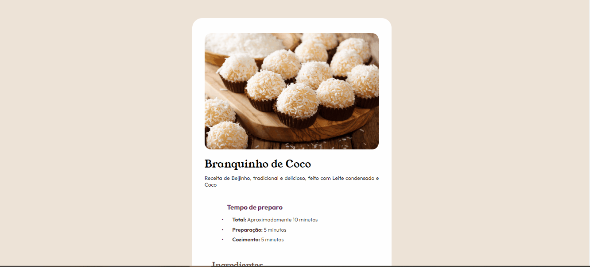

# Frontend Mentor - Recipe Page

Esta é a resolução do exercício proposto pelo site Frontend Mentor. 
## Tabela de conteúdos

  - [O desafio](#O-desafio)
  - [Screenshot](#screenshot)
  - [Meu processo](#meu-processo)
  - [Construído com](#construído-com)
  - [O que eu aprendi](#o-que-eu-aprendi)

### O desafio

O exercício é baseado na construção de um layout de uma página de receitas. Neste exercício foi utilizado apenas o HTML e o CSS. 

### Screenshot

## Meu processo

Primeiramente analisei a  imagem estática fornecida pelo exercício, marcando com retângulos coloridos cada parte a ser escrita em HTML e procurando localizar o que pertencia a cada < div>. Depois estilizar o mais parecido possível com o design para desktop

### Construído com

- Marcações semânticas em HTML5
- CSS propriedades de estilo
- Grid
- Flexbox
- CSS

### O que eu aprendi

Neste exercício aprendi organizar as < divs> e criar um container com informações em formatações diferentes usando HTML e CSS.

